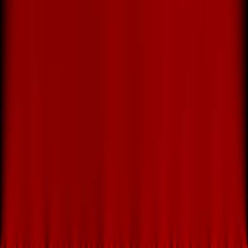
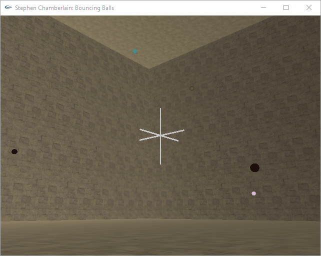
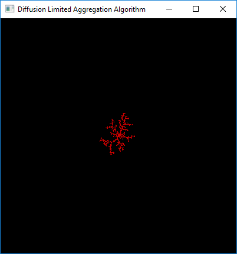
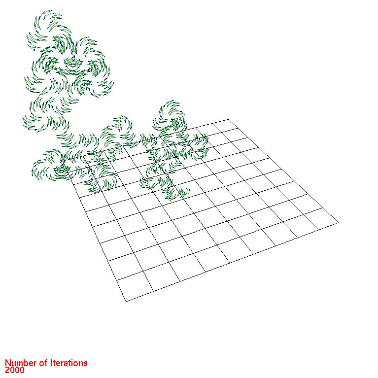
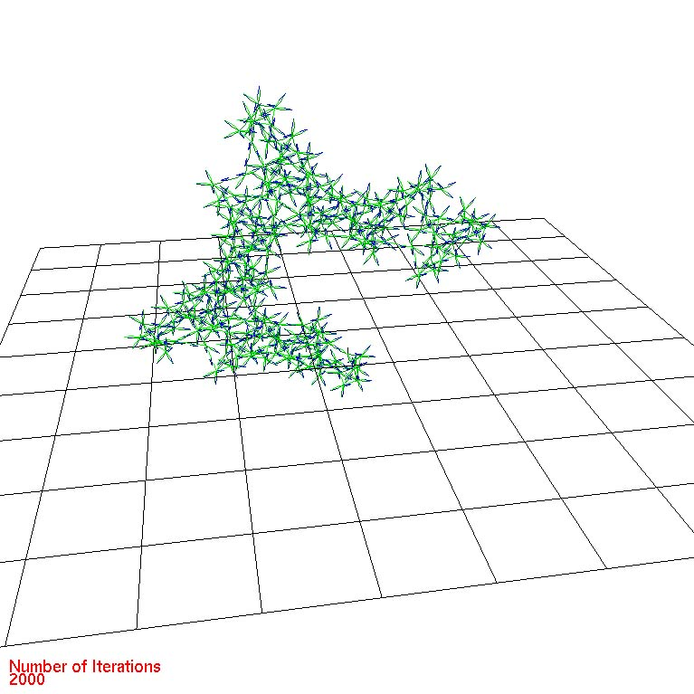

# University
For posterity; some assignments from my university days. Created between 
2000-2003.

All sources are C/C++ and most rely on the OpenGL Utility Toolkit (glut32.dll), 
a window system independent toolkit for writing OpenGL programs. Originally, the
programs were created with Visual Studio 6.0.

In order to compile and run on a more modern stack, the programs are updated to 
use FreeGLUT (http://freeglut.sourceforge.net/) and Visual Studio Community 2017.

Open the 'university.sln' solution file to browse the projects. Rebuild the 
solution to compile all projects. Binaries are created under the root build
directory.

## Autoregression:

Cloth texture generation via an autoregressive algorithm.

## Bouncing Balls:

Some basic physics and collision detection.

NOTE: does not compile right now, due to usage of old external jpeglib; needs
updating.

## Diffusion Limited Aggregation Algorithm:

Diffusion-limited aggregation (DLA) is the process whereby particles undergoing 
a random walk due to Brownian motion cluster together to form aggregates of such 
particles.

Controls
+ 1: set colour to red.
+ 2: set colour to green.
+ 3: set colour to blue.

## L-Systems:

An L-system or Lindenmayer system is a parallel rewriting system and a type of
formal grammar. L systems are applied mostly to organic systems (to describe 
growth and cell patterns), but can also be used to generate fractals. This program
is an exploration of the latter.

Controls
+ W: zoom in.
+ S: zoom out.
+ F: fullscreen.
+ Q: quit.
+ Hold mouse button and drag: pan/tilt the camera.